.. _pwrforge_clean:

Clean C/C++ project artifacts
-----------------------------

Usage
^^^^^
::

    pwrforge clean [OPTIONS]

Description
^^^^^^^^^^^

Clean build directory. Keeps the project-local ``build/.cmake_fetch_cache`` directory and does not touch user cache locations such as ``~/.cache/pwrforge/stm32cube``.

Options
^^^^^^^

::

-B, --base-dir DIRECTORY

Specify the base project path. Allows running pwrforge commands from any directory.

Example
^^^^^^^

Command:
::

    pwrforge clean

**Effects:**

Cleans directory build

Cleans directory test/build
