.. _pwrforge_debug:

Debug C/C++ project binary (x86 and stm32 supported)
----------------------------------------------------

Usage
^^^^^

::

    pwrforge debug [OPTIONS]

Description
^^^^^^^^^^^

Use gdb cli to debug binary file. If path to bin is not provided in arguments
pwrforge will look in lockfile for bin_name under project section and look for
binary on path ``build/Debug/bin/<bin_name>``.

Options
^^^^^^^

::

-b, --bin FILE

Path to a binary file

::

-t, --target [atsam|esp32|stm32|x86]

Build project for specified target. Releavant only for multitarget projects.
::

-B, --base-dir DIRECTORY

Specify the base project path. Allows running pwrforge commands from any directory.
